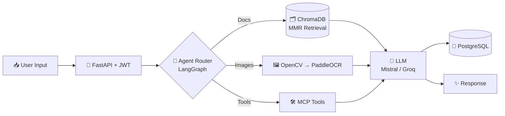

<!-- ═══════════════════ HEADER ═══════════════════ -->


<div align="center">

<a href="https://git.io/typing-svg">
  
</a>

<br/>


<br/><br/>

<a href="https://www.linkedin.com/in/manish-kumar-76976b327/"></a>
<a href="mailto:mk8229025545@gmail.com"></a>
<a href="https://github.com/utkarshraj874"></a>

<br/><br/>


</div>

<br/>

<!-- ═══════════════════ ABOUT ═══════════════════ -->
## ⚡ `whoami`

<table>
<tr>
<td width="55%" valign="top">

```python
class ManishKumar:
    def __init__(self):
        self.role      = "AI/ML Engineer"
        self.college   = "IIIT Ranchi (2024–2028)"
        self.branch    = "B.Tech, CSE"
        self.focus     = ["Agentic AI", "RAG", "LLM Apps",
                          "Computer Vision", "FastAPI"]
        self.cp_rating = "CodeChef 2★ (max 1416)"
        self.mantra    = "Learn by building. Ship by default."

    def now(self):
        return "Turning LLMs into production-grade products 🚀"

me = ManishKumar()
```

</td>
<td width="45%" valign="top">

- 🎓 B.Tech CSE @ **IIIT Ranchi**
- 🤖 Building **Agentic RAG** with LangChain & LangGraph
- 🔐 Designing secure **FastAPI + PostgreSQL** backends
- 👁️ Exploring **OCR & document AI** (PaddleOCR, OpenCV)
- 🧩 **500+** DSA problems solved
- 🤝 Open to collaboration & internships

</td>
</tr>
</table>

<!-- ═══════════════════ TECH STACK ═══════════════════ -->
## 🧰 Tech Arsenal

<div align="center">

<br/>
<sub><b>Languages & Databases</b></sub>

<br/><br/>

<br/>
<sub><b>Backend & ML</b></sub>

<br/><br/>

<br/>
<sub><b>DevOps & Tools</b></sub>

<br/><br/>


<br/>
<sub><b>Generative AI & Agentic Stack</b></sub>

</div>

<!-- ═══════════════════ PROJECTS ═══════════════════ -->
## 🚀 Featured Projects

<!-- TODO: replace each "View Repository" link with the real repo URL -->

<table>
<tr>
<td width="33%" valign="top">

### 🎤 AI Interview Simulator
`Jul 2026`

A backend-driven AI interview platform that generates questions, evaluates answers and gives feedback.

- ⚙️ **5 API modules · 16 REST endpoints**
- 🗄️ 4-table PostgreSQL schema with cascade deletion
- 🔐 JWT auth + owner-scoped access control
- 🤖 Mistral AI for generation, evaluation & feedback
- 🐳 Dockerized with Docker Compose


<a href="https://github.com/utkarshraj874?tab=repositories"><b>View Repository →</b></a>

</td>
<td width="33%" valign="top">

### 📚 PrashnaMitra
**Agentic RAG PDF Chatbot** · `Mar 2026`

Chat with 100+ page documents using an agent that picks the right tool for every question.

- 🧩 1,000-char chunks, 150 overlap
- 🔎 MMR search: top-4 from 20 candidates
- 🕸️ LangGraph agent routing + **MCP tools**
- 🛠️ Search, metadata, calculator, summaries, study guides, question generation
- 💾 Persistent chat history in PostgreSQL


<a href="https://github.com/utkarshraj874?tab=repositories"><b>View Repository →</b></a>

</td>
<td width="33%" valign="top">

### 📜 Historical Document Restoration
`Sep 2026`

AI system that restores degraded documents through a 3-stage pipeline.

- 🖼️ OpenCV preprocessing → 🔤 PaddleOCR → 🧠 Groq LLM cleanup
- 📍 Handles confidence scores & bounding boxes
- ⚙️ **10 FastAPI endpoints**, JWT + owner-scoped access
- 📊 Streamlit dashboard with OCR visualization & export
- ♻️ Exponential-backoff retries for LLM rate limits


<a href="https://github.com/utkarshraj874?tab=repositories"><b>View Repository →</b></a>

</td>
</tr>
</table>

### 🧬 How my AI pipelines flow



<!-- ═══════════════════ ACHIEVEMENTS ═══════════════════ -->
## 🏆 Achievements

<div align="center">

| 🧮 Problems Solved | ⭐ CodeChef | 🌍 Best Global Rank | 🇮🇳 JEE Mains AIR |
|:---:|:---:|:---:|:---:|
| **500+** DSA | **2-Star** · max **1416** | **590** (also 611, 792) | **24,640** / 1M+ |

</div>

## 📊 GitHub Analytics

<div align="center">


</div>

## 💬 Quote of the Day

<div align="center">
  
</div>

## 🌐 Let's Connect

<div align="center">

<a href="https://www.linkedin.com/in/manish-kumar-76976b327/"></a>
<a href="mailto:mk8229025545@gmail.com"></a>
<a href="https://github.com/utkarshraj874"></a>

<br/><br/>

<i>"Building intelligence. One experiment at a time."</i>

</div>


